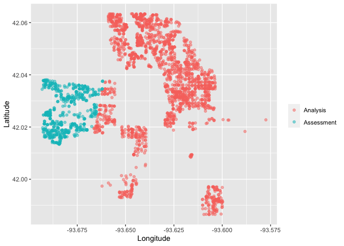

<!-- README.md is generated from README.Rmd. Please edit that file -->

# spatialsample

<!-- badges: start -->

[](https://github.com/tidymodels/spatialsample/actions)
[](https://codecov.io/gh/tidymodels/spatialsample?branch=master)
[](https://lifecycle.r-lib.org/articles/stages.html)
<!-- badges: end -->

## Introduction

The goal of spatialsample is to provide functions and classes for
spatial resampling to use with
[rsample](https://rsample.tidymodels.org/), including:

-   [spatial clustering
    cross-validation](https://doi.org/10.1109/IGARSS.2012.6352393)

The implementation of more spatial resampling approaches is planned.

Like [rsample](https://rsample.tidymodels.org/), spatialsample provides
building blocks for creating and analyzing resamples of a spatial data
set but does not include code for modeling or computing statistics. The
resampled data sets created by spatialsample are efficient and do not
have much memory overhead.

## Installation

You can install the released version of spatialsample from
[CRAN](https://CRAN.R-project.org) with:

``` r
install.packages("spatialsample")
```

And the development version from [GitHub](https://github.com/) with:

``` r
# install.packages("devtools")
devtools::install_github("tidymodels/spatialsample")
```

## Example

The most straightforward spatial resampling strategy with the lightest
dependencies is `spatial_clustering_cv()`, which uses k-means clustering
to identify cross-validation folds:

``` r
library(spatialsample)
data("ames", package = "modeldata")

set.seed(1234)
folds <- spatial_clustering_cv(ames, coords = c("Latitude", "Longitude"), v = 5)

folds
#> #  5-fold spatial cross-validation 
#> # A tibble: 5 x 2
#>   splits             id   
#>   <list>             <chr>
#> 1 <split [2332/598]> Fold1
#> 2 <split [2187/743]> Fold2
#> 3 <split [2570/360]> Fold3
#> 4 <split [2118/812]> Fold4
#> 5 <split [2513/417]> Fold5
```

In this example, the `ames` data on houses in Ames, IA is resampled with
`v = 5`; notice that the resulting partitions do not contain an equal
number of observations.

We can create a helper plotting function to visualize the five folds.

``` r
library(ggplot2)
library(purrr)
library(dplyr)
#> 
#> Attaching package: 'dplyr'
#> The following objects are masked from 'package:stats':
#> 
#>     filter, lag
#> The following objects are masked from 'package:base':
#> 
#>     intersect, setdiff, setequal, union

plot_splits <- function(split) {
    p <- analysis(split) %>%
        mutate(analysis = "Analysis") %>%
        bind_rows(assessment(split) %>%
                      mutate(analysis = "Assessment")) %>%
        ggplot(aes(Longitude, Latitude, color = analysis)) + 
        geom_point(alpha = 0.5) +
        labs(color = NULL)
    print(p)
}

walk(folds$splits, plot_splits)
```



## Contributing

This project is released with a [Contributor Code of
Conduct](https://contributor-covenant.org/version/2/0/CODE_OF_CONDUCT.html).
By contributing to this project, you agree to abide by its terms.

-   For questions and discussions about tidymodels packages, modeling,
    and machine learning, please [post on RStudio
    Community](https://community.rstudio.com/new-topic?category_id=15&tags=tidymodels,question).

-   If you think you have encountered a bug, please [submit an
    issue](https://github.com/tidymodels/rules/issues).

-   Either way, learn how to create and share a
    [reprex](https://reprex.tidyverse.org/articles/articles/learn-reprex.html)
    (a minimal, reproducible example), to clearly communicate about your
    code.

-   Check out further details on [contributing guidelines for tidymodels
    packages](https://www.tidymodels.org/contribute/) and [how to get
    help](https://www.tidymodels.org/help/).
