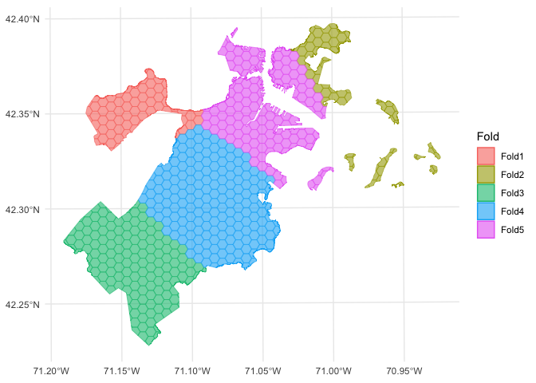
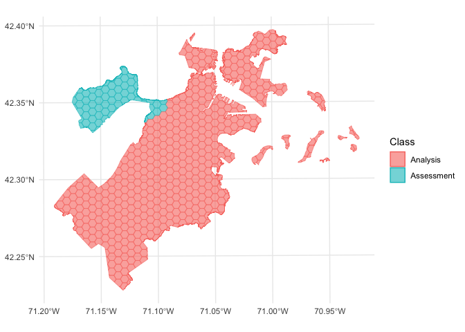

<!-- README.md is generated from README.Rmd. Please edit that file -->

# spatialsample <a href='https://spatialsample.tidymodels.org'></a>

<!-- badges: start -->

[](https://github.com/tidymodels/spatialsample/actions/workflows/R-CMD-check.yaml)
[](https://CRAN.R-project.org/package=spatialsample)
[](https://app.codecov.io/gh/tidymodels/spatialsample?branch=main)
[](https://lifecycle.r-lib.org/articles/stages.html)
<!-- badges: end -->

## Introduction

The goal of spatialsample is to provide functions and classes for
spatial resampling to use with
[rsample](https://rsample.tidymodels.org/), including:

-   [spatial clustering
    cross-validation](https://doi.org/10.1109/IGARSS.2012.6352393)
-   [spatial block cross-validation](https://doi.org/10.1111/ecog.02881)
-   [spatially buffered
    cross-validation](https://doi.org/10.1111/geb.12161)
-   [leave-location-out
    cross-validation](https://doi.org/10.1016/j.envsoft.2017.12.001)

Like [rsample](https://rsample.tidymodels.org/), spatialsample provides
building blocks for creating and analyzing resamples of a spatial data
set but does not include code for modeling or computing statistics. The
resampled data sets created by spatialsample are efficient and do not
have much memory overhead.

## Installation

You can install the released version of spatialsample from
[CRAN](https://CRAN.R-project.org) with:

``` r
install.packages("spatialsample")
```

And the development version from [GitHub](https://github.com/) with:

``` r
# install.packages("devtools")
devtools::install_github("tidymodels/spatialsample")
```

## Example

The most straightforward spatial resampling strategy is
`spatial_clustering_cv()`, which uses k-means clustering to identify
cross-validation folds:

``` r
library(spatialsample)

set.seed(1234)
folds <- spatial_clustering_cv(boston_canopy, v = 5)

folds
#> #  5-fold spatial cross-validation 
#> # A tibble: 5 × 2
#>   splits            id   
#>   <list>            <chr>
#> 1 <split [600/82]>  Fold1
#> 2 <split [589/93]>  Fold2
#> 3 <split [524/158]> Fold3
#> 4 <split [497/185]> Fold4
#> 5 <split [518/164]> Fold5
```

In this example, the `boston_canopy` data on tree cover in Boston, MA is
resampled with `v = 5`; notice that the resulting partitions do not
contain an equal number of observations.

In addition to resampling algorithms, spatialsample provides methods to
visualize resamples using [ggplot2](https://ggplot2.tidyverse.org/)
through the `autoplot()` function:

``` r
autoplot(folds)
```



We can use the same function to visualize each fold separately:

``` r
library(purrr)

walk(folds$splits, function(x) print(autoplot(x)))
```



So far, we’ve only scratched the surface of the functionality
spatialsample provides. For more information, check out the [Getting
Started](https://spatialsample.tidymodels.org/articles/spatialsample.html)
documentation!

## Contributing

This project is released with a [Contributor Code of
Conduct](https://contributor-covenant.org/version/2/1/CODE_OF_CONDUCT.html).
By contributing to this project, you agree to abide by its terms.

-   For questions and discussions about tidymodels packages, modeling,
    and machine learning, please [post on RStudio
    Community](https://community.rstudio.com/new-topic?category_id=15&tags=tidymodels,question).

-   If you think you have encountered a bug, please [submit an
    issue](https://github.com/tidymodels/rules/issues).

-   Either way, learn how to create and share a
    [reprex](https://reprex.tidyverse.org/articles/articles/learn-reprex.html)
    (a minimal, reproducible example), to clearly communicate about your
    code.

-   Check out further details on [contributing guidelines for tidymodels
    packages](https://www.tidymodels.org/contribute/) and [how to get
    help](https://www.tidymodels.org/help/).
