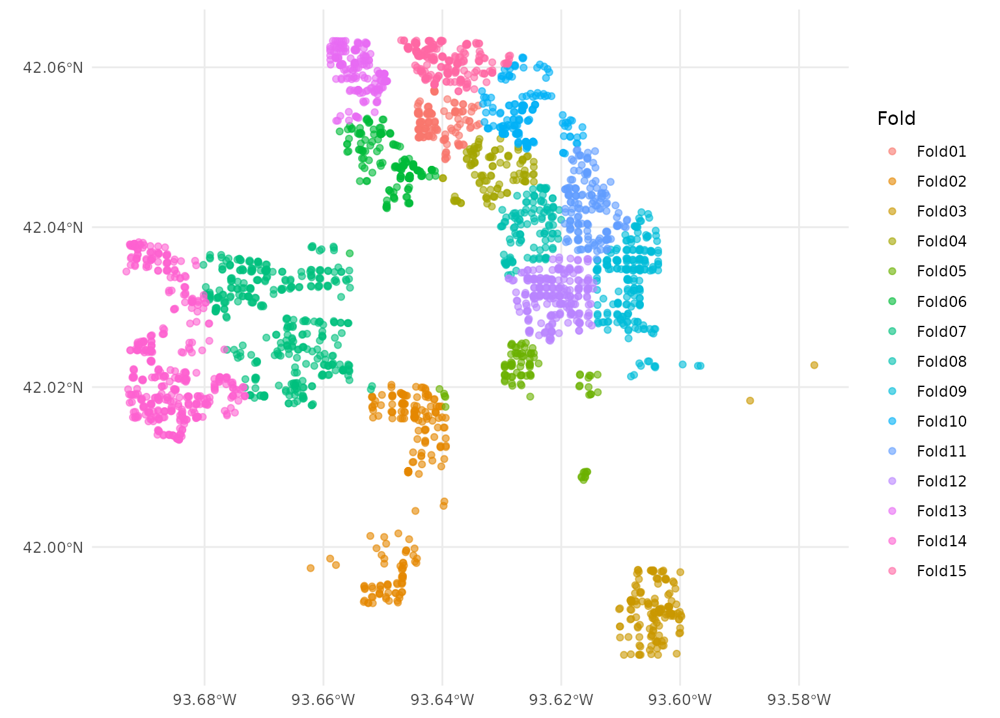
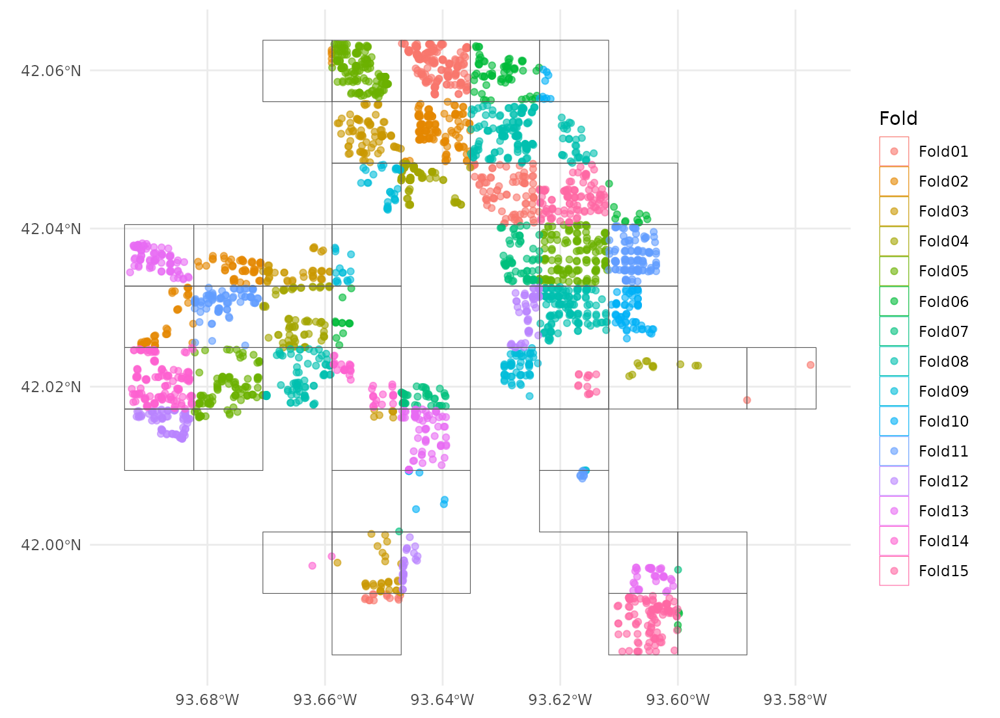
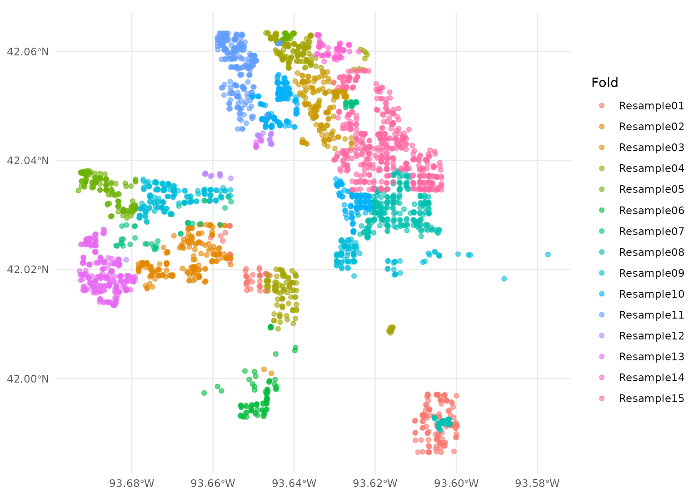
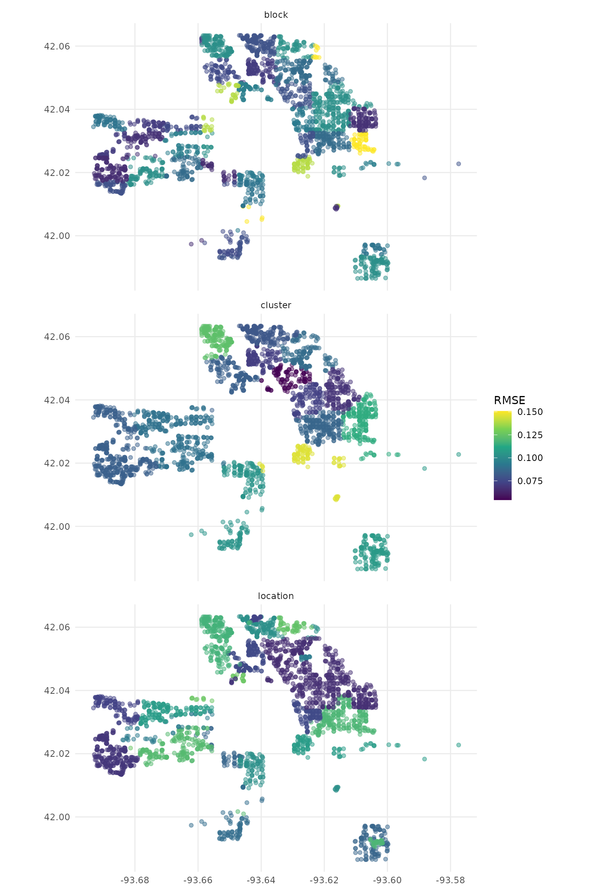

# Using spatial resamples for analysis

The resampled objects created by spatialsample can be used in many of
the same ways that those created by
[rsample](https://rsample.tidymodels.org/) can, from making comparisons
to evaluating models. These objects can be used together with other
parts of the [tidymodels](https://www.tidymodels.org/) framework, but
let’s walk through a more basic example using linear modeling of housing
data from Ames, IA.

``` r

data("ames", package = "modeldata")
```

The Ames housing data is a normal
[tibble](https://tibble.tidyverse.org/). While many of the functions in
spatialsample support standard tibbles, several require that our data be
an [sf](https://r-spatial.github.io/sf/) object to properly handle
spatial distance calculations. We can transform our Ames data into an sf
object using the
[`sf::st_as_sf()`](https://r-spatial.github.io/sf/reference/st_as_sf.html)
function:

``` r

ames_sf <- sf::st_as_sf(
  ames,
  # "coords" is in x/y order -- so longitude goes first!
  coords = c("Longitude", "Latitude"),
  # Set our coordinate reference system to EPSG:4326,
  # the standard WGS84 geodetic coordinate reference system
  crs = 4326
)
```

For this vignette, we’ll model the sale prices of the houses in the Ames
data set. Let’s say that the sale price of these houses depends on the
year they were built, their living area (size), and the type of house
they are (duplex vs. townhouse vs. single family), along with perhaps
interactions between type and house size.

``` r

log10(Sale_Price) ~ Year_Built + Gr_Liv_Area + Bldg_Type
```

This relationship may exhibit spatial autocorrelation across the city of
Ames, and we can use any of the several different methods provided by
spatialsample to try and investigate it.

For instance, we could create `v = 15` spatial cross-validation folds
with
[`spatial_clustering_cv()`](https://spatialsample.tidymodels.org/dev/reference/spatial_clustering_cv.md),
which [uses k-means clustering in order to divide the data into
folds](https://doi.org/10.1109/IGARSS.2012.6352393). We can then
visualize those folds using the
[`autoplot()`](https://ggplot2.tidyverse.org/reference/autoplot.html)
function from spatialsample:

``` r

library(spatialsample)

set.seed(123)
cluster_folds <- spatial_clustering_cv(ames_sf, v = 15)

autoplot(cluster_folds)
```



Our `cluster_folds` object is an `rset` object that contains many
resamples or `rsplit` objects in the `splits` column. The resulting
partitions do not necessarily contain an equal number of observations:

``` r

cluster_folds
#> #  15-fold spatial cross-validation 
#> # A tibble: 15 × 2
#>    splits             id    
#>    <list>             <chr> 
#>  1 <split [2797/133]> Fold01
#>  2 <split [2724/206]> Fold02
#>  3 <split [2777/153]> Fold03
#>  4 <split [2830/100]> Fold04
#>  5 <split [2836/94]>  Fold05
#>  6 <split [2759/171]> Fold06
#>  7 <split [2560/370]> Fold07
#>  8 <split [2810/120]> Fold08
#>  9 <split [2715/215]> Fold09
#> 10 <split [2776/154]> Fold10
#> 11 <split [2778/152]> Fold11
#> 12 <split [2695/235]> Fold12
#> 13 <split [2750/180]> Fold13
#> 14 <split [2496/434]> Fold14
#> 15 <split [2717/213]> Fold15
```

But while spatial clustering is *a* method for spatial cross-validation
using spatialsample, it is not the only method available. The other
methods are broadly similar, breaking the data into a number of (not
necessarily even) folds based on spatial arrangement.

For instance, the
[`spatial_block_cv()`](https://spatialsample.tidymodels.org/dev/reference/spatial_block_cv.md)
function will perform [spatial
blocking](https://doi.org/10.1111/ecog.02881) with your data:

``` r

set.seed(123)
block_folds <- spatial_block_cv(ames_sf, v = 15)

autoplot(block_folds)
```



If you already have a sense of what locations in your data are likely to
be closely related, you can also use the
[`spatial_leave_location_out_cv()`](https://spatialsample.tidymodels.org/dev/reference/spatial_vfold.md)
function to perform [leave-location-out
cross-validation](https://doi.org/10.1016/j.envsoft.2017.12.001). For
instance, we can split the Ames data into folds based on neighborhoods
using this function:

``` r

set.seed(123)
location_folds <-
  spatial_leave_location_out_cv(
    ames_sf,
    group = Neighborhood,
    v = 15
  )

autoplot(location_folds)
```



We’ve now got a lot of different resamples floating around! We’re going
to fit the same models to each of them, in the same way, using the same
code. In order to make that task a little easier, let’s add a new column
named `type` to signal what type of resample each fold is from, and then
combine them into a new data frame:

``` r

cluster_folds$type <- "cluster"
block_folds$type <- "block"
location_folds$type <- "location"

resamples <-
  dplyr::bind_rows(
    cluster_folds,
    block_folds,
    location_folds
  )
```

Now let’s write a function that will, for each resample:

- obtain the *analysis* set for model fitting
- fit a linear model with a interaction term
- predict the *assessment* set and return both the true and predicted
  price, on the log scale

``` r

# `splits` will be the `rsplit` object
compute_preds <- function(splits) {
  # fit the model to the analysis set
  mod <- lm(log10(Sale_Price) ~ Year_Built + Bldg_Type * log10(Gr_Liv_Area),
    data = analysis(splits)
  )
  # identify the assessment set
  holdout <- assessment(splits)
  # return the assessment set, with true and predicted price
  tibble::tibble(
    geometry = holdout$geometry,
    Sale_Price = log10(holdout$Sale_Price),
    .pred = predict(mod, holdout)
  )
}
```

We can apply this function to just one of the `splits`.

``` r

compute_preds(cluster_folds$splits[[7]])
#> # A tibble: 370 × 3
#>                geometry Sale_Price .pred
#>             <POINT [°]>      <dbl> <dbl>
#>  1 (-93.67907 42.03608)       4.83  4.99
#>  2 (-93.67721 42.03654)       5.05  5.20
#>  3 (-93.67367 42.03479)       5.17  5.14
#>  4 (-93.67096 42.03569)       5.14  5.06
#>  5  (-93.6721 42.03486)       5.09  5.07
#>  6 (-93.67207 42.03457)       5.12  5.11
#>  7 (-93.66969 42.03533)       5.10  5.10
#>  8  (-93.66067 42.0346)       5.23  5.25
#>  9 (-93.65921 42.03456)       5.12  5.26
#> 10 (-93.65623 42.03345)       5.39  5.33
#> # ℹ 360 more rows
```

Or we can apply this function to all of the `splits`, using
[`purrr::map()`](https://purrr.tidyverse.org/reference/map.html).

``` r

library(purrr)
library(dplyr)
#> 
#> Attaching package: 'dplyr'
#> The following objects are masked from 'package:stats':
#> 
#>     filter, lag
#> The following objects are masked from 'package:base':
#> 
#>     intersect, setdiff, setequal, union

cv_res <- resamples %>%
  mutate(.preds = map(splits, compute_preds))
```

We can [`unnest()`](https://tidyr.tidyverse.org/reference/unnest.html)
these results and [use yardstick to compute any regression metrics
appropriate to this modeling
analysis](https://yardstick.tidymodels.org/reference/index.html#section-regression-metrics),
such as
[`yardstick::rmse()`](https://yardstick.tidymodels.org/reference/rmse.html):

``` r

library(tidyr)
library(yardstick)

cv_rmse <- cv_res %>%
  unnest(.preds) %>%
  group_by(id, type) %>%
  rmse(Sale_Price, .pred)

cv_rmse
#> # A tibble: 45 × 5
#>    id     type    .metric .estimator .estimate
#>    <chr>  <chr>   <chr>   <chr>          <dbl>
#>  1 Fold01 block   rmse    standard      0.0788
#>  2 Fold01 cluster rmse    standard      0.0715
#>  3 Fold02 block   rmse    standard      0.0705
#>  4 Fold02 cluster rmse    standard      0.104 
#>  5 Fold03 block   rmse    standard      0.0757
#>  6 Fold03 cluster rmse    standard      0.107 
#>  7 Fold04 block   rmse    standard      0.0962
#>  8 Fold04 cluster rmse    standard      0.0542
#>  9 Fold05 block   rmse    standard      0.103 
#> 10 Fold05 cluster rmse    standard      0.146 
#> # ℹ 35 more rows
```

It looks like the RMSE may vary across the city, so we can join the
metrics back up to our results and plot them.

``` r

library(ggplot2)

cv_res %>%
  unnest(.preds) %>%
  left_join(cv_rmse, by = c("id", "type")) %>%
  ggplot(aes(color = .estimate)) +
  geom_sf(aes(geometry = geometry), alpha = 0.5) +
  labs(color = "RMSE") +
  scale_color_viridis_c() +
  facet_wrap(vars(type), ncol = 1)
```



As you can see, the results you get are highly dependent on how you
resample your data! It’s important to use the right method for your data
(and, for methods like spatial blocking and buffered cross-validation,
the right distances).
